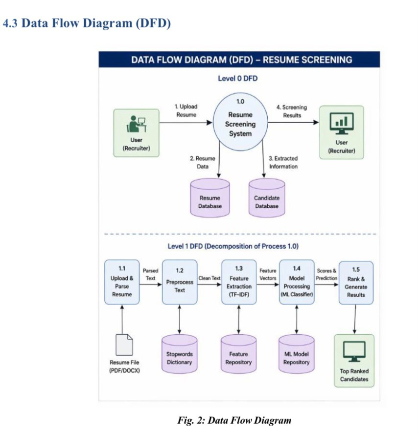
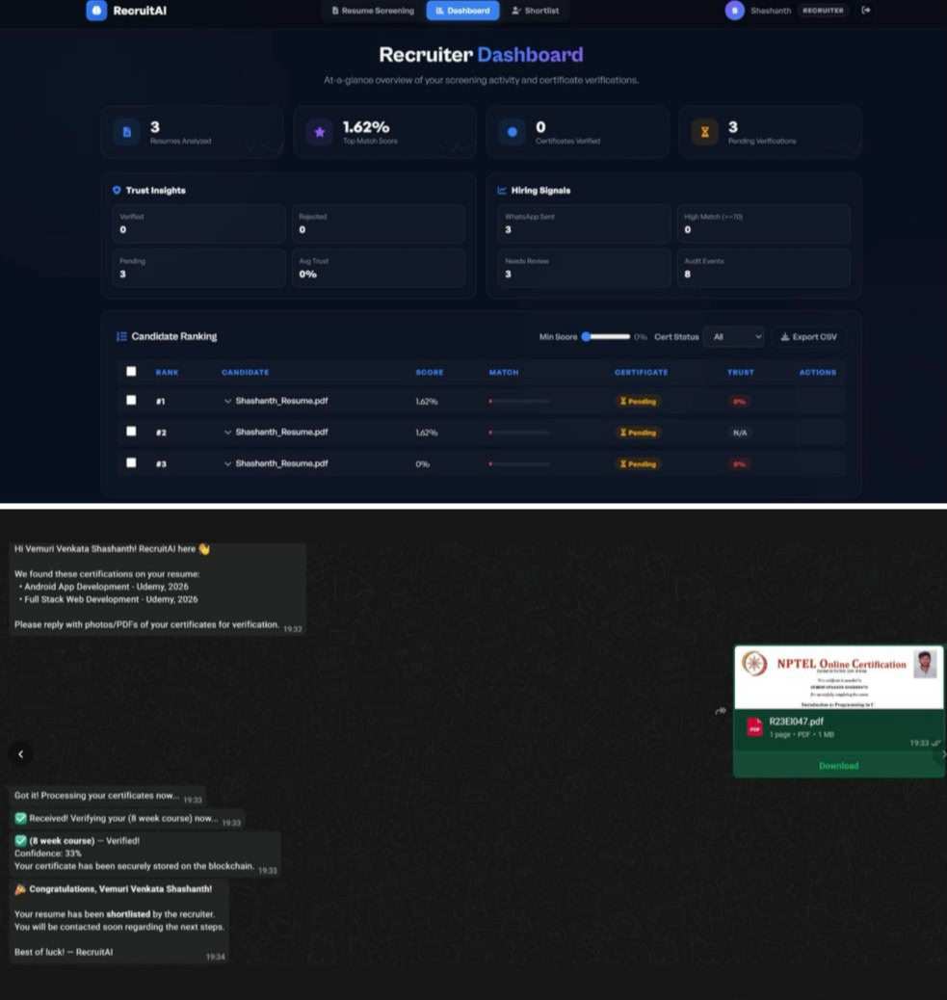

# AI-Powered Resume Screening & Blockchain Certificate Verification System

##Overview

This project integrates Artificial Intelligence (AI), Natural Language Processing (NLP), and Blockchain technology to streamline recruitment and certificate verification processes. The system automatically analyzes resumes, ranks candidates based on job requirements, and verifies certificates using blockchain-based records.

##Problem Statement

Traditional recruitment processes are time-consuming and prone to human bias. Certificate fraud is another major challenge faced by organizations. This project addresses both issues by automating candidate screening and enabling secure certificate verification.

## Features

* Automated resume screening
* Candidate ranking and shortlisting
* NLP-based text analysis
* Blockchain certificate verification
* Secure and transparent validation process
* User-friendly interface

## Technologies Used

* Python
* Machine Learning
* Natural Language Processing (NLP)
* Streamlit
* Ethereum
* Solidity
* Ganache
* MetaMask
* Web3.py

## System Workflow

1. Candidate uploads resume.
2. Resume is processed using NLP techniques.
3. Machine learning model evaluates and ranks candidates.
4. Certificate data is verified using blockchain records.
5. Recruiter receives screening and verification results.

## Project Screenshots
## Project Workflow

## Output

## Future Enhancements

* Advanced NLP models
* Public blockchain deployment
* Cloud deployment
* Real-time recruitment integrations

## Project Showcase Repository

This repository serves as a project showcase containing documentation, screenshots, and project artifacts.

The implementation/source code for the project is available at:

https://github.com/Shashanth-V/AI-Resume-Screening

